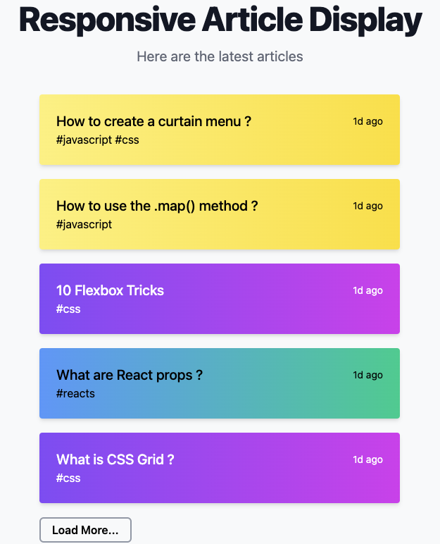

# Tailwind-CSS-Component: Responsive article display

This GitHub repository contains the HTML and TailwindCSS code for an elegant, responsive article display interface. 
Designed to showcase various articles, the interface features a clean layout with a gradient theme that visually categorizes articles.

#### Features
- **Responsive Design**: Ensures the interface works seamlessly across different devices.
- **TailwindCSS for Styling**: Utilizes TailwindCSS for efficient and flexible styling, accessed via Play CDN which requires no installation.
- **Interactive Elements**: Includes hover effects and animations to enhance user experience.

#### Included Files
- `index.html`: Contains the HTML structure of the page.

#### Usage
To use or modify this project, no installation process is required thanks to the use of Play CDN for TailwindCSS. You can simply clone the repository and open the `index.html` file in your browser.
